# openai-tool2mcp

[](https://img.shields.io/github/v/release/alohays/openai-tool2mcp)
[](https://github.com/alohays/openai-tool2mcp/actions/workflows/main.yml?query=branch%3Amain)
[](https://codecov.io/gh/alohays/openai-tool2mcp)
[](https://img.shields.io/github/commit-activity/m/alohays/openai-tool2mcp)
[](https://img.shields.io/github/license/alohays/openai-tool2mcp)

**openai-tool2mcp** is a lightweight, open-source bridge that wraps OpenAI's powerful built-in tools as Model Context Protocol (MCP) servers. It enables you to use high-quality OpenAI tools like web search and code interpreter with Claude and other MCP-compatible models.

- 🔍 **Use OpenAI's robust web search in Claude App**
- 💻 **Access code interpreter functionality in any MCP-compatible LLM**
- 🔄 **Seamless protocol translation between OpenAI and MCP**
- 🛠️ **Simple API for easy integration**

## The Developer's Dilemma

AI developers currently face a challenging choice between two ecosystems:

```mermaid
graph TD
    subgraph "Developer's Dilemma"
        style Developer fill:#ff9e64,stroke:#fff,stroke-width:2px
        Developer((Developer))
    end

    subgraph "OpenAI's Ecosystem"
        style OpenAITools fill:#bb9af7,stroke:#fff,stroke-width:2px
        style Tracing fill:#bb9af7,stroke:#fff,stroke-width:2px
        style Evaluation fill:#bb9af7,stroke:#fff,stroke-width:2px
        style VendorLock fill:#f7768e,stroke:#fff,stroke-width:2px,stroke-dasharray: 5 5

        OpenAITools["Built-in Tools<br/>(Web Search, Code Interpreter)"]
        Tracing["Advanced Tracing<br/>(Visual Debugging)"]
        Evaluation["Evaluation Dashboards<br/>(Performance Metrics)"]
        VendorLock["Vendor Lock-in<br/>⚠️ Closed Source ⚠️"]

        OpenAITools --> Tracing
        Tracing --> Evaluation
        OpenAITools -.-> VendorLock
        Tracing -.-> VendorLock
        Evaluation -.-> VendorLock
    end

    subgraph "MCP Ecosystem"
        style MCPStandard fill:#7dcfff,stroke:#fff,stroke-width:2px
        style MCPTools fill:#7dcfff,stroke:#fff,stroke-width:2px
        style OpenStandard fill:#9ece6a,stroke:#fff,stroke-width:2px
        style LimitedTools fill:#f7768e,stroke:#fff,stroke-width:2px,stroke-dasharray: 5 5

        MCPStandard["Model Context Protocol<br/>(Open Standard)"]
        MCPTools["MCP-compatible Tools"]
        OpenStandard["Open Ecosystem<br/>✅ Interoperability ✅"]
        LimitedTools["Limited Tool Quality<br/>⚠️ Less Mature (e.g., web search, computer use) ⚠️"]

        MCPStandard --> MCPTools
        MCPStandard --> OpenStandard
        MCPTools -.-> LimitedTools
    end

    Developer -->|"Wants powerful tools<br/>& visualizations"| OpenAITools
    Developer -->|"Wants open standards<br/>& interoperability"| MCPStandard

    classDef highlight fill:#ff9e64,stroke:#fff,stroke-width:4px;
    class Developer highlight
```



**openai-tool2mcp** bridges this gap by letting you use OpenAI's mature, high-quality tools within the open MCP ecosystem.

## 🌟 Features

- **Easy Setup**: Get up and running with a few simple commands
- **OpenAI Tools as MCP Servers**: Wrap powerful OpenAI built-in tools as MCP-compliant servers
- **Seamless Integration**: Works with Claude App and other MCP-compatible clients
- **Tool Support**:
  - 🔍 Web Search
  - 💻 Code Interpreter
  - 🌐 Web Browser
  - 📁 File Management
- **Open Source**: MIT licensed, hackable and extensible

## 🚀 Installation

```bash
# Install from PyPI
pip install openai-tool2mcp

# Or install the latest development version
pip install git+https://github.com/alohays/openai-tool2mcp.git
```

### Prerequisites

- Python 3.9+
- OpenAI API key with access to the Assistant API

## 🛠️ Quick Start

1. **Set your OpenAI API key**:

```bash
export OPENAI_API_KEY="your-api-key-here"
```

2. **Start the MCP server with OpenAI tools**:

```bash
openai-tool2mcp start
```

3. **Use the tools in Claude App**:

Set up your Claude App to connect to your local MCP server at `http://localhost:8000`.

## 💻 Usage Examples

### Basic Server Configuration

```python
from openai_tool2mcp import MCPServer
from openai_tool2mcp.tools import OpenAIBuiltInTools

# Create a server with OpenAI web search
server = MCPServer(tools=[OpenAIBuiltInTools.WEB_SEARCH])

# Start the server
server.start(host="127.0.0.1", port=8000)
```

### Custom Configuration

```python
from openai_tool2mcp import MCPServer, ServerConfig
from openai_tool2mcp.tools import OpenAIBuiltInTools

# Configure with multiple tools
config = ServerConfig(
    openai_api_key="your-api-key",
    tools=[
        OpenAIBuiltInTools.WEB_SEARCH,
        OpenAIBuiltInTools.CODE_INTERPRETER
    ],
    request_timeout=60
)

# Create and start server
server = MCPServer(config=config)
server.start()
```

## 📊 How It Works

The library serves as a bridge between the OpenAI Assistant API and the MCP protocol:


## 🤝 Contributing

We welcome contributions from the community! Here's how you can help:

1. **Fork** the repository
2. **Clone** your fork to your local machine
3. **Create a branch** for your feature or bugfix
4. **Make your changes** and commit them
5. **Push** to your fork and submit a **pull request**

Please make sure to follow our coding standards and add tests for any new features.

### Development Setup

```bash
# Clone the repository
git clone https://github.com/alohays/openai-tool2mcp.git
cd openai-tool2mcp

# Install in development mode
make install

# Run tests
make test

# Run linting
make lint
```

## 📄 License

This project is licensed under the MIT License - see the [LICENSE](LICENSE) file for details.

## 🙏 Acknowledgements

- The OpenAI team for their excellent tools and APIs
- The MCP community for developing an open standard for tool usage
- All contributors who have helped improve this project

---

## ⚠️ Project Status

This project is in active development. While the core functionality works, expect frequent updates and improvements. If you encounter any issues, please submit them on our [issue tracker](https://github.com/alohays/openai-tool2mcp/issues).

---

_openai-tool2mcp is part of the broader [MCPortal](https://github.com/alohays/mcportal) initiative to bridge OpenAI's tools with the open-source MCP ecosystem._
